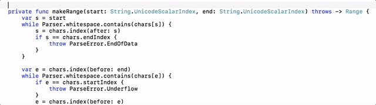
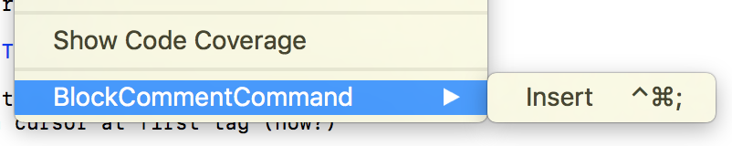

# BlockComment

Xcode 8 source editor extension for Swift editing that will insert a block comment, possibly with some tags.

> **NOTE**: I know about Xcode's own `Add Documentation` command which does the same thing, but with more
> knowledge about the code being commented on. This was more of a learning exercise. I also like my style of
> comments over Xcode's use of '///' everywhere.

The command does a rudimentary scan forward from the cursor, looking for something to comment. If it finds a
`func` or `init` expression, it will insert a block comment describing the function definition. It also has
tailored block comments for `struct`, `class`, `enum` and propertie expressions (`var` and `let`). Again, it is
really crude and basic. If it cannot make sense of anthing, it will just punt and insert a generic block
comment.

The block comments have Xcode tags (text delimited by '<#' and '#>') which allow one to tab to a tag and start
typing to replace the tag with text.

# To Use

Build the main `BlockCommentApp`. This will also build the `BlockCommentCommand.appex` extension. Run the app,
and you should now have the extension installed. May need a restart of Xcode before the extension appears.

Place cursor before the entity to document, then select the `Insert` menu command (or assign a key shortcut in
Xcode preferences

# Code

The code parsing takes place in `BulkCommentCommand/Parse.swift` The other files are there to provide the plumbing for 
Xcode extension and the application which delivers the extension.
